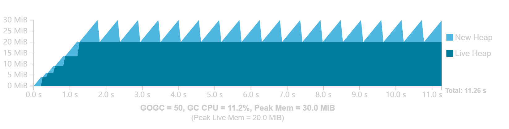
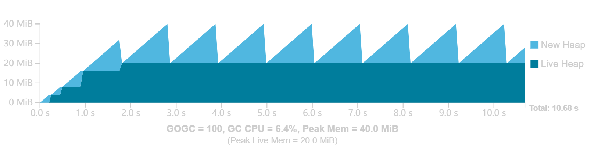

## Go 垃圾收集（Go 1.19）

---
### Go 垃圾收集器简介

自动回收内存的另一个术语是垃圾收集。垃圾收集器（*garbage collection*，GC）是代表应用程序通过识别不再需要的内存部分来回收内存的系统。

存储在局部变量中的非指针值可能不由 Go GC 管理，Go 为这些值分配创建它的词法作用域绑定的内存。这种方式被称为 “堆栈分配”（*stack allocation*），即存储在 *goroutine* 堆栈上。

由于 Go 编译器无法确定某些值的生存期，因此无法在堆栈上分配内存的 Go 值被称为逃逸到堆（*heap*）。在堆上分配内存的行为通常被称为 “动态内存分配”，编译器和运行时都可以对如何使用这些内存以及何时可以清理这些内存做出最少的假设。GC 是一个专门识别和清理动态内存分配的系统。

Go 值需要逃逸到堆中的原因有很多。例如，它的大小是动态确定的；一个切片底层数组的初始大小由一个变量而不是一个常量决定。逃逸到堆必须是可传递的：如果一个 Go 值的引用被写入另一个已经确定要逃逸的 Go 值，那么这个值也必须逃逸。一个 Go 值是否逃逸取决于它的上下文和 Go 编译器的逃逸分析算法。

>---
#### 跟踪式垃圾收集

Go 垃圾收集是跟踪式垃圾收集，它通过跟随指针传递来标识正在使用（或活动，*live*）的对象。

- Object：对象是一个动态分配的内存片段，包含一个或多个 Go 值。
- Pointer：引用对象中任何值的内存地址。这也包括形式为 `*T` 的 Go 值和部分内置 Go 值。字符串、切片、通道、映射和接口值都包含 GC 必须跟踪的内存地址。

对象和指向其他对象的指针一起构成了对象图（*object* *graph*）。为了识别活动（*live*）内存，GC 从程序的根（*roots*）开始遍历扫描（*scanning*）对象图，这些根是标识程序明确使用的对象的指针。根的两个例子是局部变量和全局变量。

Go GC 使用标记 - 清除（*mark-sweep*）技术：GC 将它遇到的值标记为 *live* 以便追踪其进度。一旦跟踪完成，GC 就会遍历堆中的所有内存，并使所有未标记的可用内存用于分配。这一过程称为清除（*sweeping*）。

一种替代技术是将对象实际移动到内存的新部分，并留下一个转发指针，该指针稍后用于更新应用程序的所有指针。这种方式移动对象的 GC 称为移动（*moving*）GC；Go 有一个非移动（*non-moving*）GC。

---
### GC 循环

Go GC 大致分为两个阶段：标记阶段和清除阶段。在所有内存都被跟踪之前，不可能释放内存以进行分配，因为仍然可能有一个未扫描的指针保持对象活动。因此，清除行为必须与标记行为完全分开。此外，当没有 GC 相关工作要做时，GC 可能完全不活动。GC 在 GC 循环中不断地经历清除、关闭和标记这三个阶段。GC 周期从扫描开始，关闭，然后标记。

>---
#### GC 成本模型

GC 本质上是一个构建在更复杂系统上的复杂软件。
- GC 只涉及两个资源：CPU 时间和物理内存。
- GC 的内存开销包括活动堆内存、标记阶段之前分配的新堆内存和元数据空间。活动堆内存是指在前一个 GC 周期中被确定为活动的内存，而新堆内存是指在当前周期中分配的任何内存。
- GC 的 CPU 成本被建模为每个周期的固定成本，以及与活动堆的大小成比例的边际成本。

这个模型准确地分类了 GC 的主要成本，但没有说明这些成本的大小以及它们如何相互作用。为了对此进行建模，指定稳态（*steady-state*）。
- 应用程序分配新内存的速率（以每秒字节为单位）是恒定的。分配速率与新内存是否活动无关。
- 应用程序的对象图每次看起来大致相同（对象大小相似，指针数量大致恒定，图的最大深度大致恒定）。

稳态代表了应用程序在某些恒定工作负载下的行为。即使在应用程序执行时，工作负载也可能发生变化，但通常应用程序行为看起来像是一堆稳定状态，中间有一些瞬态行为。稳态没有对活动堆做任何假设。活动堆可能随着每个后续 GC 周期而增长，也可能缩小，或者保持不变。

在稳态下，当活动堆大小恒定时，只要 GC 在相同时间之后执行，每个 GC 周期在成本模型中看起来都是相同的。在固定时间内，应用程序以固定的分配速率分配固定数量的新堆内存。因此，使用活动堆大小常量和新堆内存常量，内存使用量始终相同。由于活动堆的大小相同，因此边际 GC CPU 成本也是相同的，固定成本将以一定的时间间隔产生。

假设 GC 决定将运行时间点向后移动，应用程序将分配更多的内存，但每个 GC 周期仍然会产生相同的 CPU 成本。但是在其他一些固定的时间窗口内，完成的 GC 周期会更少，从而降低整体 CPU 成本。但如果 GC 决定提前启动，则会出现相反的情况：分配的内存会更少，CPU 开销会更频繁。

这种情况表示了 GC 可以在 CPU 时间和内存之间做出的基本权衡，这由 GC 实际执行的频率（*frequency*）控制。在 Go 中，决定何时启动 GC 是用户可以控制的主要参数。

>---
#### GOGC

在高级别上，GOGC 决定 GC CPU 和内存之间的权衡。它的工作原理是确定每个 GC 周期后的目标堆大小，即下一个周期中总堆大小的目标值。GC 的目标是在总堆大小超过目标堆大小之前完成收集周期。总堆大小定义为上一个周期结束时的活动堆大小，加上应用程序自上一个周期以来分配的任何新堆内存。目标堆内存定义为：

<pre>
    目标堆 = 活动堆 + (活动堆 + GC roots) * GOGC / 100
</pre>

例如一个 Go 程序，其活动堆大小为 8 MiB，goroutine 堆栈为 1 MiB，全局变量中的指针为 1 MiB。如果 GOGC 值为 100，则在下一次 GC 运行之前分配的新内存量将为 10 MiB（= (8+1+1) * GOGC/100），因此总堆占用量为 18 MiB（=8+10）。如果 GOGC 值为 50，那么它将是 50%，即 5 MiB。如果GOGC值为200，则它将是200%，即20 MiB。

GOGC 可以通过 GOGC 环境变量（所有 Go 程序都能识别）配置，也可以通过 `runtime/debug` 包中的 `SetGCPercent` 配置。GOGC 可以通过设置 `GOGC=off` 或调用 `SetGCPercent(-1)` 来完全关闭 GC（假设内存限制不适用）。从概念上讲，此设置相当于将 GOGC 设置为无穷大，因为触发 GC 之前的内存增量是无限的。

假设一个程序，该程序的非 GC 工作需要 10 秒的CPU时间才能完成。在第一秒，它在进入稳定状态之前执行一些初始化步骤（增长其活动堆）。应用程序总共分配 200 MiB，每次活动 20 MiB。它假设要完成的唯一相关 GC 工作来自活动堆。

GC 总是会引起一些 CPU 和峰值内存开销。随着 GOGC 的增加，CPU 开销会减少，但峰值内存会与活动堆大小成比例地增加。随着 GOGC 的减少，峰值内存需求也会减少，但会增加 CPU 开销。

假设一个更现实的例子，同样在没有 GC 的情况下，应用程序需要 10 个 CPU 秒才能完成，但在中途，稳态的分配速率会显著增加，并且活动堆大小在第一阶段会发生一点变化。更高的分配速率将导致更频繁的 GC 周期。

>---
#### 内存限制

>---
#### 延迟

>---
#### 额外资源

---
### 虚拟内存

---
### 优化指南

---
