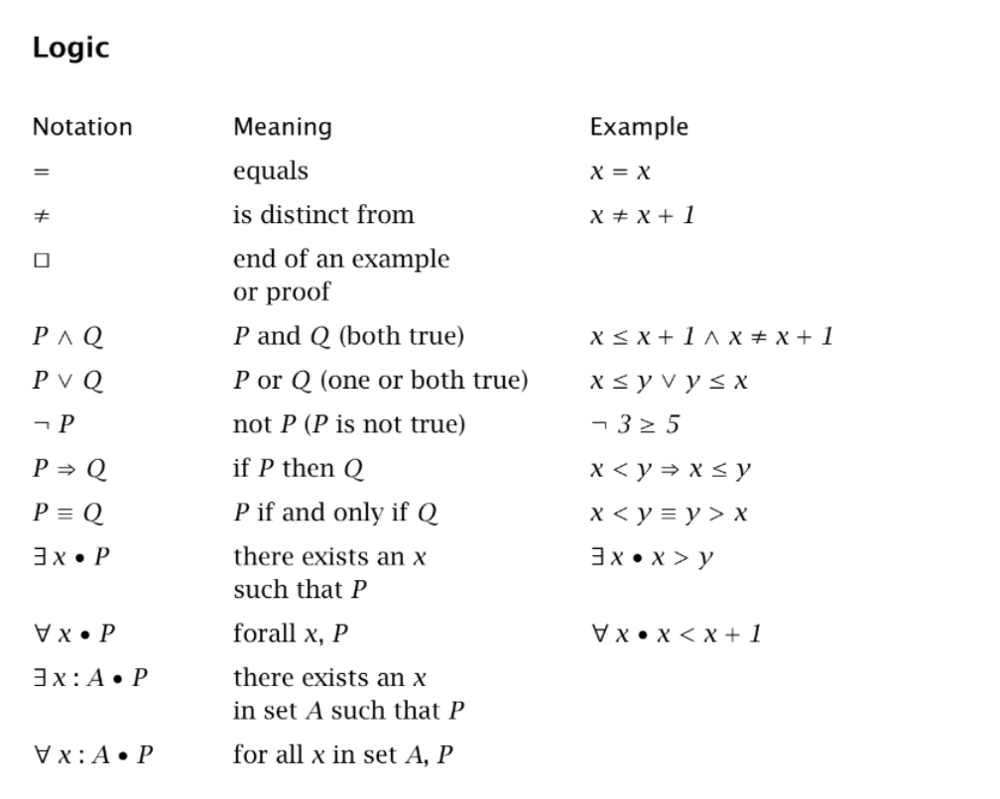
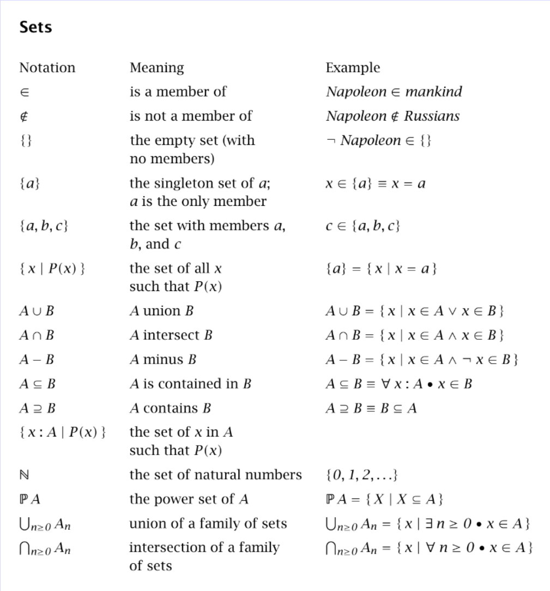
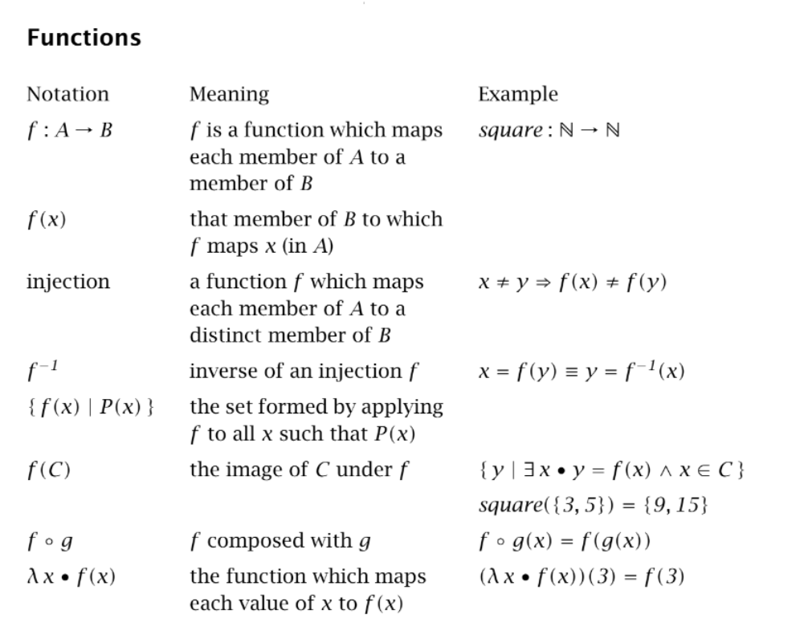
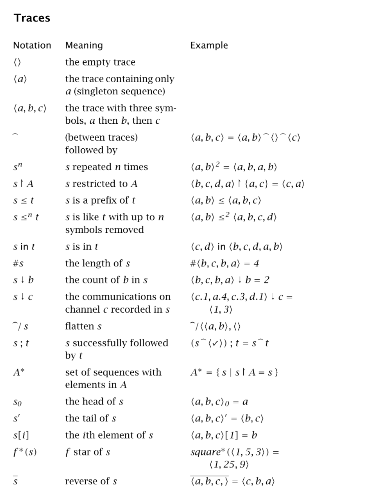
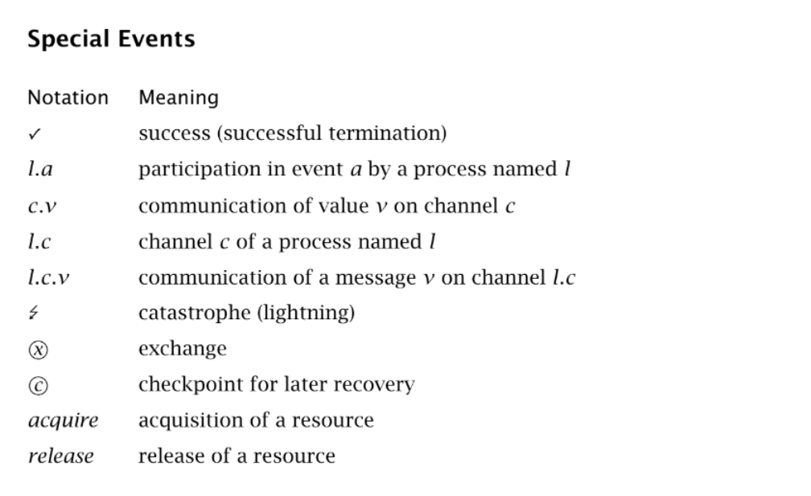
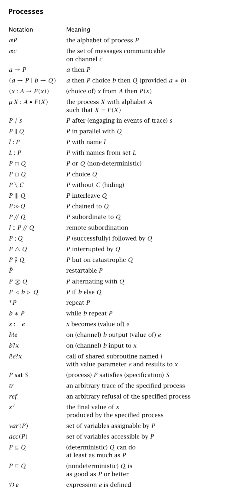
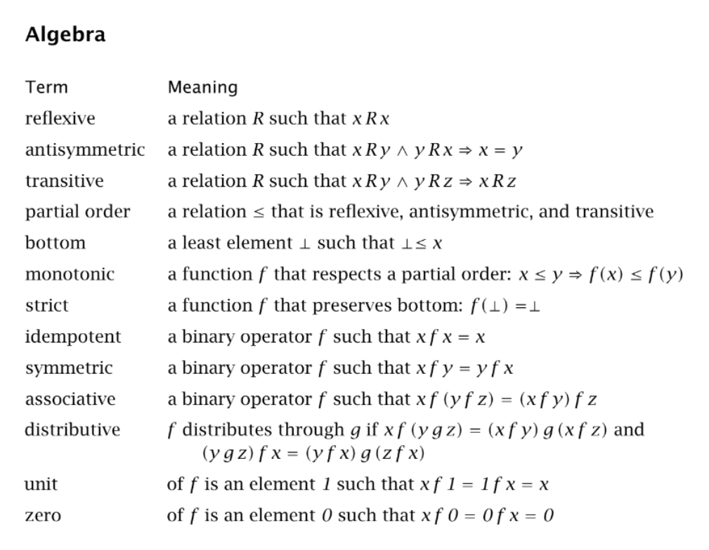
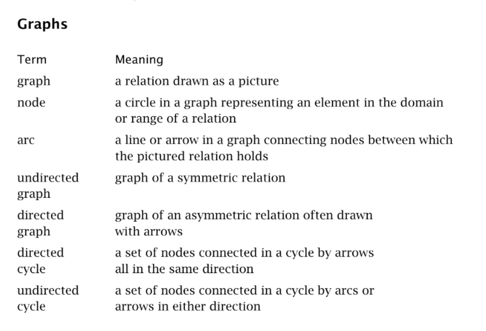

## 摘要：Communicating Sequential Processes

- 第一章介绍了进程 *Process* 的基本概念。进程是系统和环境之间相互作用的数学抽象。它展示了如何使用递归技术来描述一个生命周期很长或永远的进程。第二部分解释了进程的行为如何被记录为它所参与的动作序列的轨迹。一个进程可以在实现之前通过描述其轨迹的属性来指定。

+ 第二章描述了如何将进程组装成系统，其中组件相互作用并与外部环境相互作用。第二部分展示了如何通过更改它们所参与的事件的名称来方便地适应新的目的。

- 第三章给出了一个已知的最简单的非确定性问题的解。非确定性被证明是实现抽象的一种重要技术，在我们决定忽略或隐藏一个系统行为中不再感兴趣的那些方面时，自然而然地就会产生非确定性。后半部分给出了不确定性进程概念的完整数学定义。

+ 第四章介绍了通信。通信是两个进程之间交互的一种特殊情况，其中一个进程输出消息，另一个同时输入消息。因此通信是同步的；如果通信需要缓冲，可以在两个进程之间插入一个缓冲进程来实现。

- 第五章展示了如何将顺序程序设计的传统运算集成到通信顺序进程的框架中。

+ 第六章描述了如何构建和实现一个系统。在这个系统中，有限数量的物理资源可以在更多的进程中共享，这些进程的资源需求随时间而变化。每个资源都表示为单个进程，每当用户进程需要一个资源时，就会创建一个新的虚拟资源。一个虚拟资源是一个进程，它可以和实际的物理资源进行通信。

- 第七章描述了并发和通信的一些代替方法。

---
### 符号术语表

---
### Process

<!--  TODO -->

