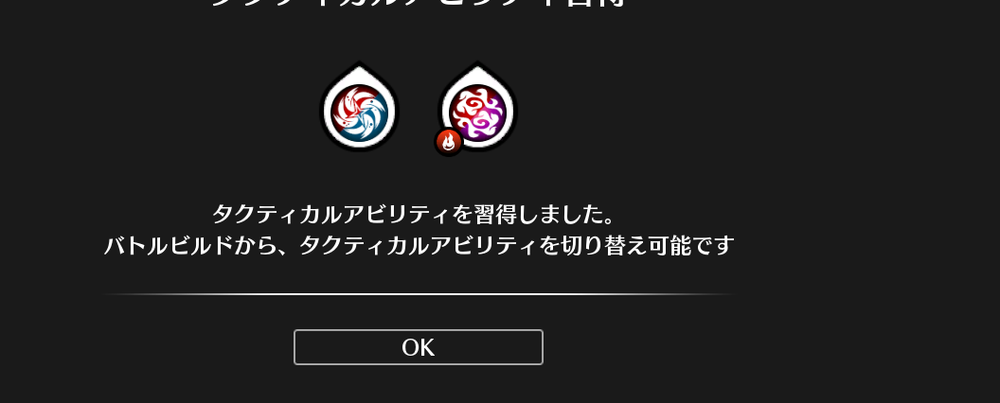

## Package slice

Slice 包提供了一些对任意类型的切片的功能函数。

| Identifier                           | Description |
| :----------------------------------- | :---------- |
| <a id="myDIV"><code>BinarySearchFunc</code></a> |              |

---
### 