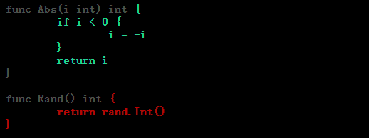

<div id="top" style="z-index:99999999;position:fixed;bottom:35px;right:50px;float:right">
	<a href="./code/testing_test.go" target="_blank"></img></a>
	<a href="#TOP" ></img></a>
	<a href="..\README.md"></img></a>
</div>
<a id="TOP"></a>

## Package [testing](https://pkg.go.dev/testing)

包 `testing` 为 Go 包的自动化测试提供了支持，它与 [`go test`](https://pkg.go.dev/cmd/go#hdr-Test_packages) 命令一起使用。

```shell
go test [build/test flags] [packages] [build/test flags & test binary flags]
```

`go test` 命令期望在测试文件中找到与被测包对应的测试（`TextXxx`）、基准（`BenchmarkXxx`）、模糊测试（`FuzzXxx`）和示例（`ExampleXxx`）函数。

```go
func TestXxx(t *testing.T)          // 测试  `go test -run=^Test`
func BenchmarkXxx(b *testing.B)     // 基准测试 `go test -run=NONE -bench=Benchmark`
func FuzzXxx(f *testing.F)          // 模糊测试 `go test -run=NONE -fuzz=Fuzz`
func ExampleXxx()                   // 示例  `go test -run=Example`
```

测试文件以 `_test.go` 结尾，这类文件在常规包正常构建过程中被排除。测试文件可以与被测文件在同一个包中，也可以在后缀为 “*_test” 的独立包中（黑盒测试，不使用常规包的内部标识）。

---
### Testing Functions

#### TestXxx

```go
func TestXxx(t *testing.T) { ... }   //? go test
```

`go test` 命令自动执行 `TestXxx` 的任何函数。

```go
//? go test -v -run=^TestXxx$
func TestXxx(t *testing.T) {
	t.Log("Testing `TestXxx`")
}
```
```shell
$ go test -v -run=^TestXxx$
=== RUN   TestXxx
    testing_test.go:24: Testing `TestXxx`
--- PASS: TestXxx (0.00s)
ok      golib/testing/gostd_testing     0.205s
```

>---
#### BenchmarkXxx

```go
func BenchmarkXxx(b *testing.B) { ... }  //? go test -bench regexp
```

`BenchmarkXxx` 函数被认为是基准测试，由 `go test -bench regexp` 命令执行。基准测试按顺序运行。

```go
//? go test -run=NONE -bench=^BenchmarkXxx$ [-benchtime=3s] [-benchmem]
func BenchmarkXxx(b *testing.B) {
	//? 迭代足够次数或运行足够时长来计算单次操作 body 使用的近似时间
	for i := 0; i < b.N; i++ {
		// body
		doSomething(100)
	}
}
```
```shell
$ go test -run=NONE -bench=^BenchmarkXxx$   
...
BenchmarkXxx-32           170772              6999 ns/op
...
```

>---
#### ExampleXxx 

```go
func ExampleIdentifier() { ... }  // for Identifier
// 命名约定
func Example() { ... }      // for package
func ExampleF() { ... }     // for function F
func ExampleT() { ... }     // for type T
func ExampleT_M() { ... }   // for method T.M
```

`testing` 包可以运行并验证 `Example` 代码。`Example` 函数可以包括以 `"Output:"` 开始的结束行注释，并且在测试运行时与函数的标准输出进行比较。`"Unordered output:"` 注释可以忽略输出顺序。没有输出注释的示例函数被编译但不被执行。

```go
//? go test -v -run=Example
func ExampleIdentifier() { // for Identifier
	Println(Identifier)
	// output: Hello World
}
func Example() { // for package
	Println("Testing unordered output")
	for k, v := range M {
		Println(k, v)
	}
	// unordered output: Testing Example
	// 4 d
	// 3 c
	// 2 b
	// 1 a
}
func ExampleT_M() { // for method T.M
	T.M("Testing T_M")
	// output: Testing T_M
}
```

可以通过将不同的后缀（小写）附加到名称来提供用于包 / 类型 / 函数 / 方法的多个示例函数。

```go
func Example_suffix() { ... }
func ExampleF_suffix() { ... }
func ExampleT_suffix() { ... }
func ExampleT_M_suffix() { ... }
```

>---
#### FuzzXxx

```go
func FuzzXxx(f *testing.F) { ... }
```

`go test` 和 `testing` 包支持模糊测试，测试使用随机生成的输入调用函数，以查找单元测试未预料到的错误。

```go
//? go test -v -run=NONE -fuzz=^FuzzXxx$ [-parallel=8] [-fuzztime=5s] [-short]
func FuzzXxx(f *testing.F) {
	mlimit := debug.SetMemoryLimit(1000 * 100)
	mTreads := debug.SetMaxThreads(1000)
	f.Cleanup(func() {
		debug.SetMemoryLimit(mlimit)
		debug.SetMaxThreads(mTreads)
	}) //? 防止 Fuzzing abort

	f.Log("Fuzzing `FuzzXxx`")
	added := []int{1, 2, 3, 4, 5, 6, 7, 8, 9, 0}
	for _, v := range added {
		//? Add 添加种子用料
		f.Add(v)
	}
	//? Fuzz 运行模糊目标函数 ff
	f.Fuzz(func(t *testing.T, up int) {
		if up < 2 {
			t.SkipNow()
			return
		}
		// else i > 0, do something
		doSomething(up)
	})
}
```
```shell
$ go test -v -run=NONE -fuzz=Fuzz -fuzztime=5s -short   
...
=== RUN   FuzzXxx
    testing_test.go:37: Fuzzing `FuzzXxx`
fuzz: elapsed: 0s, gathering baseline coverage: 0/10 completed
fuzz: elapsed: 0s, gathering baseline coverage: 10/10 completed, now fuzzing with 32 workers
fuzz: elapsed: 3s, execs: 2819918 (938592/sec), new interesting: 2 (total: 12)
fuzz: elapsed: 5s, execs: 4764957 (928592/sec), new interesting: 2 (total: 12)
--- PASS: FuzzXxx (5.11s)
...
```

*Fuzzing* 是一种自动化测试，它不断地操纵程序的输入来发现 bug。Go *fuzzing* 使用覆盖率（*coverage*）指导来智能地遍历被模糊化的代码，以发现并向用户报告失败。

```go
func FuzzXxx(f *Testing.F) {
    f.Add(seed)  // add Seed to corpus
    f.Fuzz(fuzz_target)  // Fuzz target

    // fuzz_target : func(t *testing.T, fuzzing_args ...any)
    /*
        fuzz_target 模糊目标中除了 (*F).Failed, Name 函数，不能调用其他任何 *F 的方法。
        fuzzing_args 参数是要模糊化的类型，仅允许 []byte, string, bool,
          byte, rune, float32, float64, int, int8, int16, int32, int64, 
          uint, uint8, uint16, uint32, uint64
    */

    // seed 类型必须与 fuzzing_arg 类型相同且顺序相同
    /* 
        f.Fuzz(func(*testing.T, []byte, int64) {})
        f.Add([]byte{...}, int64(...))
    */
}
```

模糊测试维护一个种子语料库（*seed corpus*），或者一组默认运行的输入，并且可以生成种子输入。种子输入可以通过调用 `(*F).Add` 或通过将文件存储在包含模糊测试的包内的目录 `testdata/fuzz/<Name>`（其中 `<Name>` 是模糊测试的名称）中来注册。

传递给 `(*F).Fuzz` 的函数是模糊测试中的模糊目标 `fuzz`。模糊目标必须接受一个 `*T` 参数，后跟一个或多个随机输入参数。传递给 `(*F).Add` 的参数类型必须与这些参数的类型相同，顺序相同。`fuzz` 可能以与 Test 测试相同的方式发出发现问题的信号：例如通过调用 `T.Fail`（或任何调用它的方法，如 `T.Error` 或 `T.Fatal`）或通过 *panicking*。

如果模糊目标 `fuzz` 对于给定的输入失败，模糊引擎会将导致失败的输入写入包目录中的目录 `testdata/fuzz/<FuzzXxx>` 下的文件。模糊引擎将这个失败输入的文件添加到种子语料库进行模糊测试。如果无法在该位置写入文件（例如，因为该目录是只读的），则模糊引擎会将文件写入构建缓存内的模糊缓存目录。

>---
#### Sub-Test、Sub-Benchmark

`T` 和 `B` 的 `Run` 方法允许定义子测试和子基准测试，而不必为每个子测试和子基准定义单独的函数。每个子测试和子基准都有一个唯一的名称。

```go
func TestFoo(t *testing.T) {
    // <setup code>
    t.Run("A=1", func(t *testing.T) { ... })
    t.Run("A=2", func(t *testing.T) { ... })
    t.Run("B=1", func(t *testing.T) { ... })
    // <tear-down code>
}
```

`-run`、`-bench` 和 `-fuzz` 命令行标志的参数是一个匹配测试名称的非锚定正则表达式。使用反斜杠时表示匹配子测试名称。

```shell
go test -run ''        # Run all tests.
go test -run Foo       # Run top-level tests matching "Foo", such as "TestFooBar".
go test -run Foo/A=    # For top-level tests matching "Foo", run subtests matching "A=".
go test -run /A=1      # For all top-level tests, run subtests matching "A=1".
go test -fuzz FuzzFoo  # Fuzz the target matching "FuzzFoo"
```

子测试也可用于控制并行性。父测试仅在其所有子测试完成后才完成。

```go
func TestGroupedParallel(t *testing.T) {
    for _, tc := range tests {
        tc := tc // capture range variable
        t.Run(tc.Name, func(t *testing.T) {
            t.Parallel()
            ...
        })
    }
}

func TestTeardownParallel(t *testing.T) {
    // This Run will not return until the parallel tests finish.
    t.Run("group", func(t *testing.T) {
        t.Run("Test1", parallelTest1)
        t.Run("Test2", parallelTest2)
        t.Run("Test3", parallelTest3)
    })
    // <tear-down code>
}
```

>---
#### TestMain

```go
func TestMain(, *testing.M)
```

因如果测试文件包含 `TestMain` 函数，那么生成的测试将调用 `TestMain(m)` 而不是直接运行测试或基准测试。该函数在 *main goroutine* 中运行，可以在调用 `m.Run`（启动 *testings*）前执行任何必要的设置，或在结束测试时设置任何必要的拆卸。`m.Run` 返回将返回一个可以传递给 `os.Exit` 的退出代码。

当调用 `TestMain` 时，`flag.parse` 尚未运行。如果 `TestMain` 依赖于命令行标志，包括测试包的标志，它应该显式调用 `flag.parse`。命令行标志总是由测试或基准测试函数运行的时间来解析。

```go
//? go test [-v]
func TestMain(m *testing.M) {
	// call flag.Parse() here if TestMain uses flags
	os.Exit(m.Run())
}
// 示例
func TestMain(m *testing.M) {
	log.Println("Enter TestMain")
	//? 任何测试前的设置
		// ....
	//? 启动测试
	exitCode := m.Run()
	//? 测试结束后的拆卸
		// ....
    log.Println("Exit TestMain")
	//? 传递退出代码
	os.Exit(exitCode)
}
```

---
### Interface TB

- `TB` 是 `T`、`B` 和 `F` 的公共接口。

```go
type TB interface {
	Log(args ...any)                   // Println；对于测试，仅当测试失败或设置了 `—test. v` 标志时，才会打印文本。对于基准测试，总是打印文本
	Logf(format string, args ...any)   // Printf，可自动换行
	
	Fail()                             // 将函数标记为失败，但继续执行
	Error(args ...any)                 // Log + Fail
	Errorf(format string, args ...any) // Logf + Fail
	FailNow()                          // 将函数标记为失败，并停止其执行
	Fatal(args ...any)                 // Log + FailNow
	Fatalf(format string, args ...any) // Logf + FailNow
	Failed() bool                      // 报告函数是否失败
	
	SkipNow()                          // 将测试函数标记为已跳过，并停止其执行
	Skip(args ...any)                  // Log + SkipNow
	Skipf(format string, args ...any)  // Logf + SkipNow
	Skipped() bool                     // 报告是否跳过测试

	Cleanup(func())                    // 注册一个在（子）测试完成后要调用的函数。测试结束时，函数按注册逆序调用
	Helper()                           // 将调用方标记为测试帮助函数。当打印文件和行信息时，该函数将被跳过
	Name() string                      // 返回正在运行的（子）测试或基准的名称
	Setenv(key, value string)          // 调用 os.Setenv(key，value)，并在测试后使用 Cleanup 还原。不能用于并行测试
	TempDir() string                   // 返回一个临时目录供测试使用。测试完成后自动删除
	// contains filtered or unexported methods
}
```

>---
#### TB.Functions

- `TB` 是 `T`、`B` 和 `F` 的公共接口。

```go
//? go test -v -run=^TestTB_Functions$
func TestTB_Functions(t *testing.T) {
	t.Helper()
	beforeTest := func(t *testing.T) {
		t.Logf("Testing >>> %s", t.Name())
		// 测试结束时按注册逆序依次调用
		t.Cleanup(func() {
			t.Logf("End Test >>> %s", t.Name())
		})
	}
	t.Run("Fail", func(t *testing.T) {
		beforeTest(t)
		t.Cleanup(func() {
			if t.Skipped() {
				t.Log("Please use command: `go test -v -run=^TestTB$`.")
			}
		})
		var _sub *testing.T
		if runflag := flag.Lookup("test.run"); runflag != nil && runflag.Value.String() == "^TestTB$" {
			// 仅运行当前测试时故意失败
			t.Run("-run=^TestTB$", func(t *testing.T) {
				_sub = t
				t.Fatal("TestTB/Fail fails deliberately.")
			})
		} else {
			t.Skip("TestTB/Fail runs only in `-run=^TestTB$` mode.")
		}
		if _sub != nil && _sub.Failed() {
			t.Logf("%s Pass", t.Name())
		}
	})
}
```

>---
#### TB.Setenv

- `TB.Setenv` 调用 `os.Setenv`，并在测试完成后使用 `Cleanup` 进行还原。它不能在并行测试中使用。

```go
//? go test -v -run=^TestTB_Setenv&
func TestTB_Setenv(t *testing.T) {
	env := struct {
		key string
		val string
	}{
		key: "Setenv", val: "Hello World",
	}
	if v, ok := os.LookupEnv(env.key); ok {
		t.Logf("The value of Env `Setenv` is %s", v)
	} else {
		t.Setenv(env.key, env.val)
		if os.Getenv(env.key) == "Hello World" {
			t.Log("Set environment variable `Setenv:Hello World` successfully.")
		}
	}

	panickingRecover := func(name string) {
		if got := recover(); got != nil {
			t.Logf("panicking in %s: \n%#v.", name, got)
		} else {
			t.Logf("Test: %s PASS.", name)
		}
	}
	//? 测试完成后，将恢复 Setenv 进入（子）测试之前的值
	t.Run("RestoreWhileTestCompleted", func(t *testing.T) {
		t.Setenv(env.key, "dlroW olleH")
		t.Logf("Change env %s to %s", env.key, os.Getenv(env.key))
	})
	if os.Getenv(env.key) == env.val {
		t.Log("The environment variable `Setenv:Hello World` restores.")
	}

	//? Setenv 不能用于并行测试或具有并行祖先的测试
	t.Run("ParallelAfterSetenv", func(t *testing.T) {
		defer panickingRecover(t.Name())
		t.Setenv("Setenv", "Hello")
		t.Parallel()
	})

	t.Run("ParallelBeforeSetenv", func(t *testing.T) {
		defer panickingRecover(t.Name())
		t.Parallel()
		t.Setenv("Setenv", "Hello")
	})

	t.Run("ParallelParentBeforeSetenv", func(t *testing.T) {
		t.Parallel()
		t.Run("child", func(t *testing.T) {
			defer panickingRecover(t.Name())
			t.Setenv("Setenv", "Hello")
		})
	})
}
```

>---
#### TB.TempDir

- `TB.TempDir` 返回一个临时目录供测试使用。当（子）测试完成时自动删除。

```go
//? go test -v -run=^TestTB_TempDir$
func TestTB_TempDir(t *testing.T) {
	var dir string
	fn_checkDir := func(dir string) {
		fi, err := os.Stat(dir)
		if fi != nil {
			t.Fatalf("Directory %q from user Cleanup still exists", dir)
		}
		if !os.IsNotExist(err) {
			t.Fatalf("Unexpected error: %v", err)
		}
	}

	t.Run("CheckExist", func(t *testing.T) {
		dirCh := make(chan string, 1)
		t.Cleanup(func() {
			// 验证目录 directory 已经在测试完成时被删除
			select {
			case dir := <-dirCh:
				fn_checkDir(dir)
			default:
				if !t.Failed() {
					t.Fatal("never received dir channel")
				}
			}
		})
		dir := t.TempDir()
		t.Logf("create a tempDir=%v\n", dir)
		dirCh <- dir // 传递 tempDir
	})

	t.Run("InCleanup", func(t *testing.T) {
		t.Helper()
		t.Run("test", func(t *testing.T) {
			t.Cleanup(func() {
				dir = t.TempDir()
			})
			_ = t.TempDir()
		})
		fn_checkDir(dir)
	})

	t.Run("InBenchmark", func(t *testing.T) {
		testing.Benchmark(func(b *testing.B) {
			if !b.Run("test", func(b *testing.B) {
				// Add a loop so that the test won't fail.
				for i := 0; i < b.N; i++ {
					_ = b.TempDir()
				}
			}) {
				t.Fatal("Sub test failure in a benchmark")
			}
		})
	})
}
```
  
---
### Type T

- `T`.non-common Functions
  + `Deadline` 报告测试的二进制文件的运行时间将超过 `-timeout` 指定的时间 (默认为 10m); `-timeout=0s` 表示无超时，`ok` 始终返回 `false`。
  + `Parallel` 标记并行信号，表示此测试将与其他的具有并行信号的测试并行运行。
  + `Run` 在一个单独的 goroutine 中运行子测试 `f(t *T)`。

```go
//? go test -v -run=^TestT_Functions$ [-timeout=0s]
func TestT_Functions(t *testing.T) {
	t.Run("NoParallel", func(t *testing.T) {
		t.Parallel()
		for i := 0; i < 2; i++ {
			i := i
			t.Run(fmt.Sprintf("outer%d", i), func(t *testing.T) {
				for j := 0; j < 2; j++ {
					j := j
					t.Run(fmt.Sprintf("inner%d", j), func(t *testing.T) {
						time.Sleep(2 * time.Second)
						t.Logf("End NoParallel/outer%d/inner%d", i, j)
					})
				}
				t.Logf("End NoParallel/outer%d", i)
			})
		}
	})

	t.Run("Parallel", func(t *testing.T) {
		t.Parallel()
		for i := 0; i < 2; i++ {
			i := i
			t.Run(fmt.Sprintf("outer%d", i), func(t *testing.T) {
				t.Parallel()
				for j := 0; j < 2; j++ {
					j := j
					t.Run(fmt.Sprintf("inner%d", j), func(t *testing.T) {
						t.Parallel()
						time.Sleep(2 * time.Second)
						t.Logf("End Parallel/outer%d/inner%d", i, j)
					})
				}
				t.Logf("End Parallel/outer%d", i)
			})
		}
	})

	t.Run("Deadline", func(t *testing.T) {
		t.Parallel()
		t.Logf("Running Time : %#v", time.Now())
		//? 获取测试当前函数的距离截止时间, false 表示无超时 (-timeout=0s)
		if dl, ok := t.Deadline(); !ok {
			t.Skipf("Testing deadline not set.")
		} else {
			remain := time.Until(dl) // 计算距离 deadline 的剩余时间
			if remain < 0 {          // 超时终止测试
				t.Fatal("Test has exceeded the deadline.")
			}

			t.Logf("Test sleeps for 5 seconds.")
			for i := range 6 {
				t.Logf("Test resumes after %d seconds.", 5-i)
				time.Sleep(1 * time.Second)
			}
		}
	})
}
```

---
### Type B

- `B`.non-common Functions
  - `Elapsed` 返回基准测试的目前的运行时间。
  - `StartTimer` 开始计时测试。此函数在基准测试开始之前自动调用，但也可用于在调用 `B.StopTimer` 之后恢复计时。
  - `StopTimer`	停止测试计时。例如在执行部分无需测量的复杂初始化时，暂停计时器。
  - `ResetTimer` 将基准运行时间和内存分配计数器归零，并删除用户报告的度量。它不会影响计时器是否正在运行。
  - `Run` 运行基准测试 `f` 子基准测试。
  - `RunParallel` 并行运行基准测试。它创建多个 goroutine 并在它们之间分配 `b.N` 迭代。
    - `PB.Next`: `PB` 由 `RunParallel` 用于运行并行基准测试。`Next` 报告是否有更多的迭代要执行。
  - `SetMaxelism` 将 `B.RunParallel` 使用的 goroutine 数量设置为 `p * GOMAXPROCS`。对于 CPU 限制的基准测试，通常不需要调用 `SetValuelism`。
  - `SetData` 记录单个操作中处理的字节数。如果调用此函数，基准测试将报告 ns/op 和 MB/s。
  - `ReportAllocs` 为此基准测试启用 malloc 统计信息。它等效于设置 `-test.benchmem`，但它只影响调用 `ReportAllocs` 的基准函数。
  - `ReportMetric` 将用户基准测试度量标准 “n 单位” 添加到报告的基准测试结果中。
    - 如果度量是 per/op，调用者应该除以 b.N；如果度量是 per/ns，应除以 `b.Elapsed`；
    - `ReportMetric` 覆盖同一单位以前报告的任何值。如果 unit 为空字符串或 unit 包含任何空格，`ReportMetric` 将 panic。
	- 如果 unit 是一个通常由基准框架本身报告的单位（例如 “allocs/op”），`ReportMetric` 将覆盖该度量。将 “ns/op” 设置为 0 将抑制该内置度量。

```go
//? go test -v -run=NONE -bench=^Benchmark_Functions$ [-cpu='1,2,4,8']
func Benchmark_Functions(b *testing.B) {
	b.Run("BenchmarkTimer", func(b *testing.B) {
		// Benchmark sleeps for 1 seconds
		time.Sleep(1 * time.Second)
		b.ResetTimer()

		// Benchmark stop Timer
		b.StopTimer()
		t1 := b.Elapsed()

		// Benchmark sleeps for 1 seconds
		time.Sleep(1 * time.Second)
		if b.Elapsed() != t1 {
			b.Fatalf("Timer is not stopped.")
		}
		// Benchmark resume Timer
		b.StartTimer()
		time.Sleep(1 * time.Second) // ≈ 1E9 ns/op
	})

	b.Run("ReportAllocs", func(b *testing.B) {
		b.ReportAllocs() // 对该子测试报告 `-benchmem`
		for range b.N {
			doSomething(100)
		}
	})

	b.Run("RunParallel", func(b *testing.B) {
		if testing.Short() {
			b.Skip("Skipping in short mode")
		}
		var procs atomic.Uint32
		var iters atomic.Uint64
		b.SetParallelism(3) // 3 * GOMAXPROCS 个 goroutine 数
		b.RunParallel(func(pb *testing.PB) {
			procs.Add(1)
			for pb.Next() { // 循环体在所有 goroutine 中总共执行 b.N 次
				iters.Add(1)
			}
		})
		// 校验是否创建了 3 * GOMAXPROCS 个 goroutine 数
		if want := uint32(3 * runtime.GOMAXPROCS(0)); procs.Load() != want {
			b.Errorf("got %v procs, want %v", procs.Load(), want)
		}
		// 校验原子计数是否和 b.N 相等
		if iters.Load() != uint64(b.N) {
			b.Errorf("got %v iters, want %v", iters.Load(), b.N)
		}
	})

	b.Run("ReportMetric", func(b *testing.B) {
		var compares int64
		b.ReportAllocs()
		for i := 0; i < b.N; i++ {
			s := doSomething(100)
			sort.Slice(s, func(i, j int) bool {
				compares++
				return s[i] < s[j]
			})
		}
		// 度量 `metric` 是 per-operation, 应除以 b.N, 单位为 metric/op
		b.ReportMetric(float64(compares)/float64(b.N), "compares/op")
		// 度量 `metric` 是 per-time, 应除以 b.Elapsed, 单位为 metric/ns
		b.ReportMetric(float64(compares)/float64(b.Elapsed().Nanoseconds()), "compares/ns")
	})

	b.Run("ReportMetricInParallel", func(b *testing.B) {
		var compares atomic.Int64
		s := doSomething(100)
		b.ResetTimer()
		b.RunParallel(func(pb *testing.PB) {
			for pb.Next() {
				sort.Slice(s, func(i, j int) bool {
					compares.Add(1)
					return s[i] < s[j]
				})
			}
		})
		b.SetBytes(int64(len(s)) * int64(unsafe.Sizeof(int(1))))
		b.ReportMetric(float64(compares.Load())/float64(b.N), "compares/op")
		b.ReportMetric(float64(compares.Load())/float64(b.Elapsed().Nanoseconds()), "compares/ns")
	})
}
```

---
### Type F

- `F`.non-common Functions
  - `Add` 将把参数添加到模糊测试的种子语料库中。`args` 必须匹配 `Fuzz` 目标的参数
  - `Fuzz` 运行模糊目标函数 `ff` 进行开始模糊测试。如果 `ff` 对一组模糊参数失败，这些参数将被添加到种子语料库；
	- `ff` 不能调用任何 `*F` 方法，例如 `(*F).Log`、`(*F).Error`、`(*F).Skip`。使用相应的 `*T` 方法。
	- 在 `ff` 中允许的唯一 `*F` 方法是 `(*F).Failed` 和 `(*F).Name`。

```go
//? go test -v -run=NONE -fuzz=^Fuzz_Functions$ [-fuzztime=3s] [-parallel=8] [-short]
func Fuzz_Functions(f *testing.F) {
	//? 防止异常崩溃
	mlimit := debug.SetMemoryLimit(1000 * 100)
	mTreads := debug.SetMaxThreads(1000)
	f.Cleanup(func() {
		debug.SetMemoryLimit(mlimit)
		debug.SetMaxThreads(mTreads)
	})
	for _, v := range []int{10, 20, 30, 50, 100} {
		f.Add(v)
	}
	f.Fuzz(func(t *testing.T, a int) {
		if f.Failed() {
			t.Skipf("%s Failed", f.Name())
		}
		if a < 2 {
			t.Skip()
		}
		doSomething(a)
	})
}
```


---
### AllocsPerRun 

- `AllocsPerRun` 函数返回调用 `f` 期间分配的平均次数 (allocs/op)。

```go
//? go test -v -run=^TestAllocsPerRun$
func TestAllocsPerRun(t *testing.T) {
	var allocsPerRunTests = []struct {
		name   string
		fn     func(temp *any)
		allocs float64
	}{
		{"alloc *byte", func(temp *any) { *temp = new(*byte) }, 1},
		{"alloc complex128", func(temp *any) { *temp = new(complex128) }, 1},
		{"alloc float64", func(temp *any) { *temp = new(float64) }, 1},
		{"alloc int32", func(temp *any) { *temp = new(int32) }, 1},
		{"alloc byte", func(temp *any) { *temp = new(byte) }, 1},
	}
	var temp any
	for _, tt := range allocsPerRunTests {
		if allocs := testing.AllocsPerRun(100, func() { tt.fn(&temp) }); allocs != tt.allocs {
			t.Errorf("AllocsPerRun(100, %s) = %v, want %v.", tt.name, allocs, tt.allocs)
		}
	}
}
```

---
### CoverMode, Coverage

- `CoverMode` 报告在测试的覆盖模式: `set`, `count` or `atomic`。
+ `Coverage` 报告当前代码的覆盖率, 它不能替代 `go test -cover` 和 `go tool cover` 生成的报告。

```go
//? go test -v -cover -run=^TestCoverage$ [-coverprofile='coverage.out']
//? go tool cover -html='coverage.out'
func TestCoverage(t *testing.T) {
	t.Cleanup(func() {
		// 标志 -cover 启用代码覆盖率分析, 默认为 set 模式
		coverMode := testing.CoverMode() // 未设置时返回 ""
		if coverMode == "" {
			t.Log("-cover is not enabled.")
			return
		}
		t.Logf("Cover Mode: %s, Coverage in %s is %v.", coverMode, t.Name(), testing.Coverage())
	})
	// call another file
	Perm(-100)
}
```

>---
### Short, Verbose, Testing

- `Short` 报告在测试中是否启用 `-test.short`。
+ `Verbose` 报告在测试中是否启用 `-test.v`。
- `Testing` 报告当前代码是否在测试中运行。

```go
func TestTesting(t *testing.T) {
	//? go test -v -short -run=^TestTesting$
	if !testing.Testing() {
		t.Errorf("%s runs only in programs created by `go test`.", t.Name())
	}
	if testing.Verbose() {
		t.Log("Enable -v mode.")
	}
	if !testing.Short() {
		t.Skipf("Skipping %s in non-short mode.", t.Name())
	}
}
```

---
### Init, Benchmark, BenchmarkResult

- `Init` 初始化注册测试标志，通常由 `go test` 命令自动注册。不使用指令单独调用 `Benchmark` 等函数时才需要 `Init`。
+ `Benchmark` 基准测试对单个函数进行基准测试（不依赖 `go test`）。
- `BenchmarkResult` 包含基准测试运行的结果。
  - `AllocedBytesPerOp`	返回 B/op 指标，其计算公式为 `r.MemBytes/r.N`。
  - `AllocsPerOp` 返回 allocs/op 指标，计算公式为 `r.MemAllocs/r.N`。
  - `MemString` 以与 `go test` 相同的格式返回 `r.AllocedBytesPerOp` 和 `r.AllocsPerOp`。
  - `NsPerOp` 返回 ns/op 度量。
  - `String` 返回基准测试结果的摘要。额外指标覆盖相同名称的内置指标; `String` 不包括 allocs/op 或 B/op。
*/


```go
type BenchmarkResult struct {
	N         int           // 迭代次数
	T         time.Duration // 运行基准测试的总时间
	Bytes     int64         // 单次迭代处理的字节数
	MemAllocs uint64        // 内存分配总次数
	MemBytes  uint64        // 分配的总字节数
 
	Extra map[string]float64   // 记录由 ReportMetric 添加的用户度量标准
}

```
```go
//? go test -v -run=^TestBenchmark$
func TestBenchmark(t *testing.T) {
	testBenchmark()
}
func testBenchmark() {
	testing.Init() // Init before any Benchmark without `go test`
	var br testing.BenchmarkResult = testing.Benchmark(func(b *testing.B) {
		b.ReportAllocs()
		var s []int64
		var compares int64
		for range b.N {
			s = []int64{5, 4, 3, 2, 1}
			sort.Slice(s, func(i, j int) bool {
				compares++
				return s[i] < s[j]
			})
		}
		b.SetBytes(int64(len(s)) * int64(unsafe.Sizeof(int64(0))))
		b.ReportMetric(float64(compares)/float64(b.N), "compares/op")
		b.ReportMetric(float64(compares)/float64(b.Elapsed().Milliseconds()), "compares/ms")
	})

	fmt.Println("testBenchmark\t" + br.String() + "\t" + br.MemString())
}
```

---
### go test flags

`go test` 命令同时接受应用于 `go test` 本身的标志和应用于结果测试二进制文件的标志<sup>[[↗]](https://pkg.go.dev/cmd/go#hdr-Testing_flags)</sup>。有几个标志控制分析并编写适合 `go tool pprof` 的执行配置文件。

| flag                          | description                                                                                                                                                                               |
| :---------------------------- | :---------------------------------------------------------------------------------------------------------------------------------------------------------------------------------------- |
| `-bench regexp`               | 运行匹配正则的基准测试，反斜杠（`/`）用于分割元素的测试（例如自测试）                                                                                                                     |
| `-benchtime t`                | 运行每个基准测试足够迭代的时长（`time.Duration`，默认 1s）或运行次数（`Nx`）                                                                                                              |
| `-count n`                    | 运行每个 test，benchmark，fuzz 的次数，默认 1                                                                                                                                             |
| `-cover`                      | 启用覆盖率分析                                                                                                                                                                            |
| `-covermode set,count,atomic` | 为测试的包设置覆盖率分析模式                                                                                                                                                              |
| `-coverpkg pattern1,pattern2` | 在每个测试中对匹配模式的包应用覆盖率分析                                                                                                                                                  |
| `-cpu 1,2,4`                  | 指定应该为其执行测试、基准测试或模糊测试的 GOMAXPROCS 值列表。`-cpu` 不适用于`-fuzz` 匹配的模糊测试                                                                                       |
| `-failfast`                   | 首次测试失败时，不执行新的测试                                                                                                                                                            |
| `-fullpath`                   | 在错误信息中显示完整文件名称                                                                                                                                                              |
| `-fuzz regexp`                | 运行匹配正则的模糊测试                                                                                                                                                                    |
| `-fuzztime t`                 | 运行每个模糊测试足够迭代的时长（`time.Duration`）或运行次数（`Nx`）                                                                                                                       |
| `-fuzzminimizetime t`         | 运行每个模糊测试足够迭代的最低限度的时长（`time.Duration`）或运行次数（`Nx`）                                                                                                             |
| `-json`                       | 以 JSON 形式记录详细输出和测试结果                                                                                                                                                        |
| `-list regexp`                | 列出匹配正则的 TestXxx、BenchmarkXxx、FuzzXxx 或 ExampleXxx，不会运行任何测试                                                                                                             |
| `-parallel n`                 | 允许并行执行调用 `t.Parallel` 测试函数，和运行种子语料库时调用 `t.Parallel` 的 fuzz targets。在进行 fuzzing 时，`n` 可以是同时调用模糊函数的子进程的最大数目（不管是否调用 `t.Parallel`） |
| `-run regexp`                 | 仅进行与正则匹配的 Test、Example、Fuzz 的测试函数                                                                                                                                         |
| `-short`                      | 告知长时间运行的测试缩短其运行时间                                                                                                                                                        |
| `-shuffle off,on,N`           | 随机化 Tests 和 Benchmarks 的执行顺序                                                                                                                                                     |
| `-skip regexp`                | 仅运行与正则不匹配的 Test、Example、Fuzz、Benchmark 测试函数                                                                                                                              |
| `-timeout d`                  | 测试超时时 *panic*，`d=0` 禁用超时                                                                                                                                                        |
| `-v`                          | 详细输出，在运行时记录所有测试，并打印 `Log` 和 `Logf` 调用中的所有文本                                                                                                                   |
| `-vet list`                   | 在 `go test` 期间配置 `go vet` 的调用                                                                                                                                                     |

以下标志用于在 `go test` 执行期间 *profile* 测试。

| flag                      | description                                                                        |
| :------------------------ | :--------------------------------------------------------------------------------- |
| `-benchmem`               | 打印基准测试时的内存分配统计信息                                                   |
| `-blockprofile block.out` | 当所有测试完成时，将运行 *goroutine* 阻塞 *profile* 写入指定文件                   |
| `-blockprofilerate n`     | 通过调用 `runtime.SetBlockProfileRate` 控制运行例程阻塞 *profile* 中提供的详细信息 |
| `-coverprofile cover.out` | 当所有测试通过后，将测试覆盖率 *profile* 写入指定文件                              |
| `-cpuprofile cpu.out`     | 退出前将 CPU *profile* 写入指定文件                                                |
| `-memprofile mem.out`     | 在所有测试通过后，将内存分配 *profile* 写入指定文件                                |
| `-memprofilerate n`       | 通过设置 `runtime.MemProfileRate` 来启用更精确（和昂贵）的内存分配 *profile* 文件  |
| `-mutexprofile mutex.out` | 当所有测试完成后，将互斥锁争用 *profile* 写入指定文件                              |
| `-mutexprofilefraction n` | 采样 goroutine 中持有争用互斥锁的 1/n 堆栈跟踪                                     |
| `-outputdir directory`    | 将概要 *profile* 的输出文件放在指定目录                                            |
| `-trace trace.out`        | 退出前将执行的追踪写入指定文件                                                     |

<!-- >---
#### Coverage tests

使用 `-cover` 启用测试覆盖率，`-coverprofile` 将覆盖率分析数据写入指定文件。

```shell
$ go test  -cover -coverprofile=coverage
...
coverage: 57.7% of statements
...
```

利用 `go tool cover` 指令在 web 显示覆盖测试数据。

```shell
$ go tool cover -html=coverage
``` 
-->


---